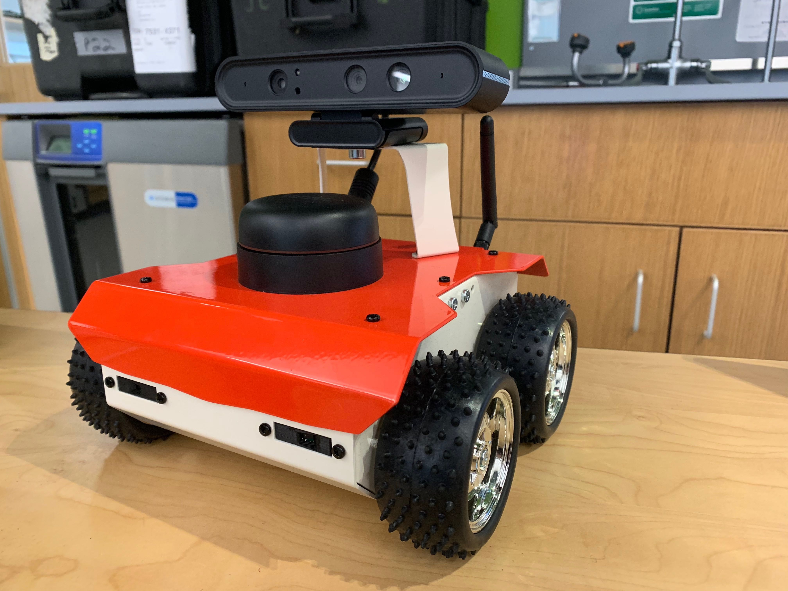
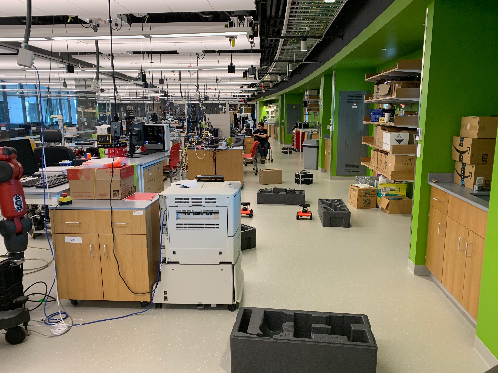

# Teleoperated Multi-ROSbot SLAM #





## Overview ##
This package contains launch files and nodes needed to let multiple Husarion 
ROSbots collaboratively map an unknown environment from unknown starting 
positions. Each robot generates its own map using lidar scans, and they are 
merged together on the `/merged_map` channel.

## Dependencies ##
In order to use all these packages, you also need to install the following ROS 
packages on each ROSBot:
- `multirobot_map_merge`
- `rosbot_description`
- `husarion_ros`


## Setup ##
In order to run this system, a single ROSbot (Jaguar) will be the ROS Master, 
and a second ROSBot (Samba) will join the ROS subnet. Additionally, one or more 
operator laptops must be on the same network in order to teleoperate the 
ROSbots. There are a number of environment variables that need to be set in 
order for the networking to function well. 
1. We found that in our VirtualBox Ubuntu machines, we needed to set our Network Adapter to Bridged mode.
2. You must know the IP address of every machine involved. Jaguar is 
`10.101.84.77` and Samba is `10.101.84.78`.
3. For every machine involved, the environment variable `ROS_MASTER_URI` must be set to 
    `http://10.101.84.77:11311`, and `ROS_IPV6` must be set to `OFF`.
4. For every machine involved, the environment variable `ROS_IP` must be set 
to the ip address of that particular computer.

## Launching the system
In order to start mapping, you will need to SSH into the both ROSbots in order 
to launch the required nodes. The username and password for both ROSbots is 'husarion'.

On Jaguar, run the following commands:
```
    cd ~/ros_workspace
    source devel/setup.sh
    roslaunch multi_rosbot_launch rosbot1_teleop_robot.launch
```

On Samba, run the following commands:
```
    cd ~/ros_workspace
    source devel/setup.sh
    roslaunch multi_rosbot_launch rosbot2_teleop_robot.launch
```


To Run Rviz on an operator computer:
```
    cd ~/ros_workspace
    source devel/setup.sh
    rviz
```

To Begin Teleoperating Jaguar from a terminal on an operator computer:
```
    cd ~/ros_workspace
    source devel/setup.sh
    roslaunch multi_rosbot_launch rosbot1_teleop.launch
```

To Begin Teleoperating Samba from a terminal on an operator computer:
```
    cd ~/ros_workspace
    source devel/setup.sh
    roslaunch multi_rosbot_launch rosbot2_teleop.launch
```

To Save a completed merged map:
```
    cd ~/ros_workspace
    source devel/setup.sh
    rosrun map_server map_saver map:=/merged_map -f <output_filename>
```

# With Great Power Comes Great Responsibility:
## Andrew
Andrew was the de facto leader of the group. He had the most experience with ROS and was able to guide every other member when they ran into any issues. Andrew was responsible for integrating the multi-map merge package into our system in both simulation and hardware. Andrew also contributed to setting up the multi-robot teleop in both simulation and hardware.
## Alex
Alex was another hard-working member. Alex spent a lot of time working alongside Andrew together they brought up the multi-map merge and multi-robot teleop. Alex also worked on the explore lite frontier exploration as well as did a lot of manual testing and driving of the rosbot systems.

## Patrick
Patrick was invaluable to setting up the Rosbots. We ran into a lot of issues when we started to move away from simulations and onto physical components. Patrick worked dilligently with Anas to get both of our Rosbots up and running, where he had to debug some hardware/ electrical issues with the Rosbots, one of which ended up being a pesky connection issue with our Lidar.

## Devin
Devin was solely responsible for bringing up the RRT package into system. This package allows for multiple agents to perform frontier exploration efficiently as they will tend towards taking different routes to explore. Devin also brought in the extra maps used in our simulations to further test our exploration algorithms.

# References:
## Husarion specfic: 
- [Husarion Multiple Machines](https://husarion.com/tutorials/ros-tutorials/5-running-ros-on-multiple-machines/)
- [Husarion SLAM](https://husarion.com/tutorials/ros-tutorials/6-slam-navigation/)
- [Huasarion Path Planning](https://husarion.com/tutorials/ros-tutorials/7-path-planning/)
- [Husarion rosbot description](https://github.com/husarion/rosbot_description)
- remapping the rosserial requires passing arguments in directly to their executable: 
`/opt/husarion/tools/rpi-linux/ros-core2-client /dev/ttyCORE2 __name:=serial_node_2 cmd_vel:=cmd_vel_2 rangeL:=rangeL_2 rangeR:=rangeR_2 pose:=pose_2`


## Nav Stack Specific
- [Navigation Stack](http://wiki.ros.org/navigation)
- [Navigation Tutorial Stack](http://wiki.ros.org/navigation/Tutorials/RobotSetup)
- [2D cost maps](http://wiki.ros.org/costmap_2d)

## tf
- [tf](http://wiki.ros.org/tf)
- [tf multiplerobots](https://answers.ros.org/question/246338/how-to-connect-tf-for-multiple-robots-in-slam/)
- [tf2 depreicates prefix](http://wiki.ros.org/tf2/Migration)
- essentially, the `tf_prefix` is not really supported since most packages failed
to implement it correctly to begin with. As a result, if you're relying on `tf_prefix`
to correctly namespace your `tf frames`, you will have a bad time. Trust us. 
Been there. Done that. 

## Beyond the Nav Stack
- [SLAM gampping](http://wiki.ros.org/gmapping?distro=hydro)
- [Multi Map Merge](http://wiki.ros.org/multirobot_map_merge)
- [Explore Lite](http://wiki.ros.org/explore_lite)
- [Emerson Boyd - EECE5698](http://emersonboyd.com/projects/multi-agent-slam)
- [Multi Robot SLAM](https://answers.ros.org/question/41433/multiple-robots-simulation-and-navigation/)
